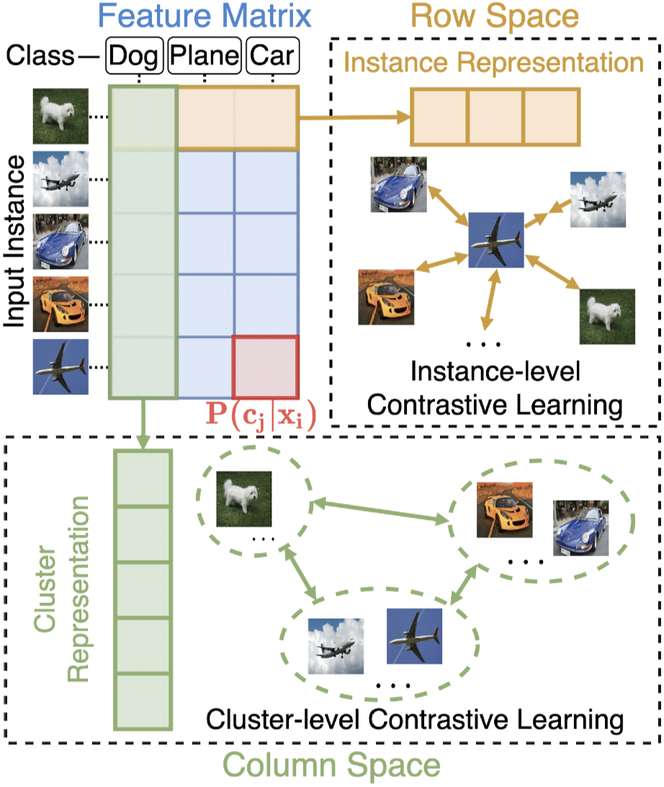
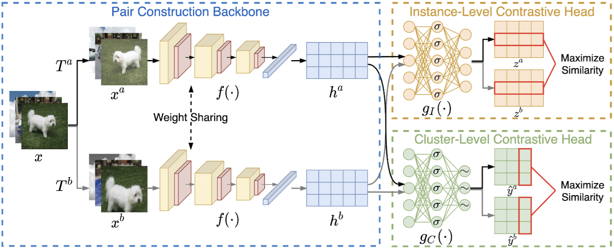

# Contrastive Clustering (CC)

This is the code for the paper "Contrastive Clustering" (AAAI 2021)
<div align=center></div>

<div align=center></div>

# Dependency

- python>=3.7
- pytorch>=1.6.0
- torchvision>=0.8.1
- munkres>=1.1.4
- numpy>=1.19.2
- opencv-python>=4.4.0.46
- pyyaml>=5.3.1
- scikit-learn>=0.23.2
- cudatoolkit>=11.0

# Usage

## Configuration

There is a configuration file "config/config.yaml", where one can edit both the training and test options.

## Training

After setting the configuration, to start training, simply run

> python train.py

Since the traning strategy for STL-10 is slightly different from others (unlabeled data is used on ICH only while training and test split are used on both ICH and CCH), to start training on STL-10, run

> python train_STL10.py

## Test

Once the training is completed, there will be a saved model in the "model_path" specified in the configuration file. To test the trained model, run

> python cluster.py

We uploaded the pretrained model which achieves the performance reported in the paper to the "save" folder for reference.

# Dataset

CIFAR-10, CIFAR-100, STL-10 will be automatically downloaded by Pytorch. Tiny-ImageNet can be downloaded from http://cs231n.stanford.edu/tiny-imagenet-200.zip. For ImageNet-10 and ImageNet-dogs, we provided their description in the "dataset" folder.

# Citation

If you find CC useful in your research, please consider citing:
```
@article{li2020contrastive,
  title={Contrastive Clustering},
  author={Li, Yunfan and Hu, Peng and Liu, Zitao and Peng, Dezhong and Zhou, Joey Tianyi and Peng, Xi},
  journal={arXiv preprint arXiv:2009.09687},
  year={2020}
}
```
